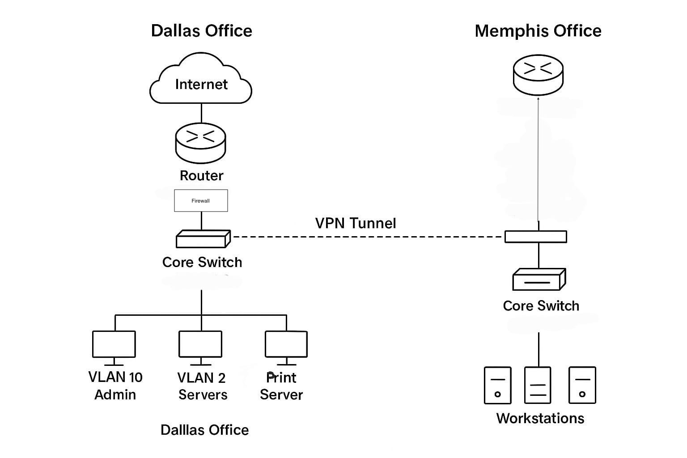
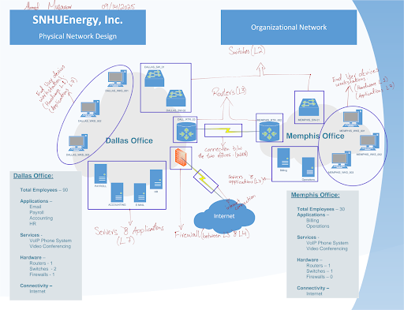
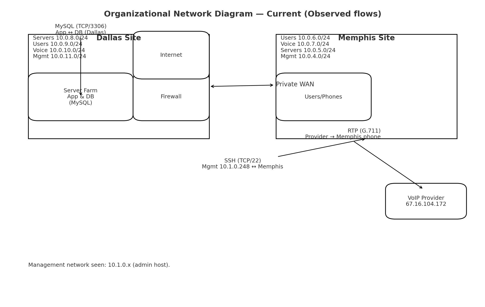
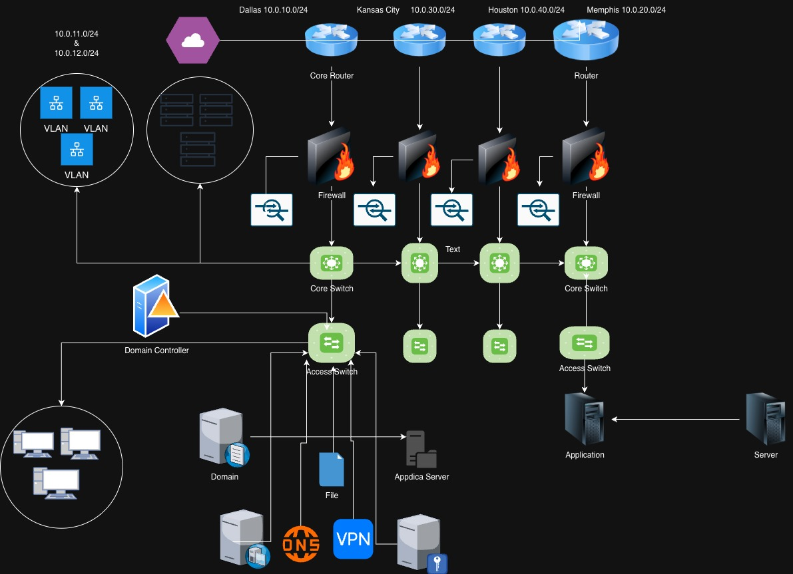
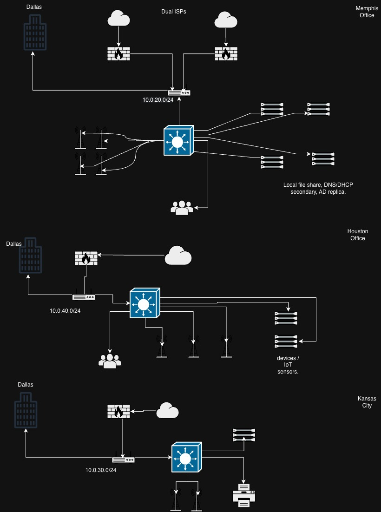

# Enterprise Network Security Design

## Project Overview

This project was completed as part of my IT-640 Telecommunications and Networking course. The goal was to 
evaluate the existing network architecture of a fictional organization, SNHUEnergy Inc., identify performance 
and security weaknesses, and design a secure and scalable network architecture to support future growth.

The organization initially operated across Dallas and Memphis and planned to expand into Houston and Kansas City. 
I analyzed the existing network, communication paths, traffic patterns, security controls, and potential 
single points of failure before developing a redesigned multi-site architecture.

## Project Objectives

- Analyze the existing LAN and WAN architecture
- Identify network performance and security vulnerabilities
- Analyze network traffic and protocols
- Design a scalable multi-site network architecture
- Improve network redundancy and high availability
- Implement network segmentation using VLANs and subnets
- Recommend stronger firewall, IDS/IPS, VPN, and authentication controls
- Incorporate centralized monitoring and SIEM
- Support secure expansion to additional office locations

## Current Network Assessment

The original network connected the Dallas headquarters and Memphis branch through a WAN. 
Dallas hosted the primary internet connection, firewall, application infrastructure, and other shared services, 
while Memphis depended heavily on the Dallas site for external connectivity.

### Key Issues Identified

- Single points of failure at the router and firewall level
- Heavy dependency on the Dallas headquarters for Memphis connectivity
- Limited redundancy across network infrastructure
- Lack of internal network segmentation
- No IDS/IPS or centralized SIEM monitoring
- Unencrypted MySQL database traffic observed during traffic analysis
- Limited protection against internal threats
- Potential network congestion as the organization expands
- Need for QoS to prioritize latency-sensitive VoIP traffic

## Network Traffic & Protocol Analysis

As part of the network assessment, I analyzed packet captures to understand how critical services communicated across the 
environment. The analysis focused on VoIP/media traffic, application-to-database communication, and remote administrative access.

### Protocols Analyzed

| Protocol | Port | Purpose | Observation |
|---|---|---|---|
| RTP | UDP | VoIP and real-time media | Continuous RTP traffic demonstrated the need for low latency and QoS prioritization |
| MySQL | TCP/3306 | Application-to-database communication | Traffic between the application and database servers appeared unencrypted |
| SSH | TCP/22 | Secure remote administration | Encrypted administrative sessions were observed between network systems |
| DNS | TCP/UDP 53 | Name resolution | Critical supporting network service |
| DHCP | UDP 67/68 | Dynamic IP addressing | Supports automatic network configuration |
| HTTPS | TCP/443 | Secure web and cloud access | Required for secure internet and cloud-based services |
| NTP | UDP/123 | Time synchronization | Important for synchronized systems, logging, and troubleshooting |

### Key Findings

- RTP traffic requires QoS prioritization to maintain voice and video quality.
- MySQL traffic should be protected using TLS encryption.
- SSH administrative access should be restricted to a dedicated management VLAN and protected with stronger authentication.
- Critical services such as DNS, DHCP, and NTP should be designed with availability and redundancy in mind.

## Proposed Secure Network Architecture

Based on the weaknesses identified in the existing environment, I designed a scalable multi-site architecture c
onnecting Dallas, Memphis, Houston, and Kansas City.

The proposed design uses Dallas as the primary hub while connecting regional offices through secure SD-WAN tunnels. R
edundant connectivity and security controls are incorporated throughout the architecture to reduce 
single points of failure and improve availability.

### Architecture Improvements

- Hub-and-spoke multi-site network architecture
- SD-WAN connectivity between office locations
- Dual ISP connections for WAN redundancy
- Redundant routers and Layer 3 switches
- OSPF for dynamic routing and automatic path selection
- Next-generation firewalls at each location
- IDS/IPS for traffic inspection and threat prevention
- VLAN segmentation for departments and management systems
- DMZ isolation for public-facing services
- Site-to-site VPN connectivity
- RADIUS and Active Directory for centralized authentication
- QoS prioritization for VoIP and real-time traffic
- SIEM integration for centralized security monitoring
- Hybrid cloud integration for scalability and business continuity
- Automated failover and load balancing

## IP Addressing & Network Segmentation

I developed a structured IP addressing strategy to support segmentation, scalability, and easier network management. 
Separate subnets and VLANs isolate critical departments and services while allowing controlled inter-VLAN communication.

| Network / Location | Subnet | Purpose |
|---|---|---|
| Dallas Core | 10.0.10.0/24 | Core infrastructure, servers, AD, DNS, DHCP, and file services |
| VLAN 10 – HR & Finance | 10.0.11.0/24 | Administrative and financial systems |
| VLAN 20 – IT & Network Management | 10.0.12.0/24 | IT and network administration |
| Memphis | 10.0.20.0/24 | Operations and billing |
| Kansas City | 10.0.30.0/24 | Transportation and logistics |
| Houston | 10.0.40.0/24 | Refining and field operations |
| SD-WAN Tunnels | 10.0.100.0/30 | Site-to-site WAN connectivity |
| Remote Access VPN | 10.0.200.0/24 | Secure remote-user connectivity |

### Design Considerations

- VLANs separate departments into distinct broadcast domains.
- Static addressing is reserved for critical infrastructure such as routers, switches, and servers.
- DHCP provides dynamic addressing for endpoint devices.
- Inter-VLAN communication can be controlled through routing and security policies.
- Redundant DNS and DHCP services improve availability.
- Address space was reserved to accommodate future departments and network growth.

## Network Diagrams

### 1. Current Network Architecture

The initial environment connects the Dallas headquarters and Memphis office, with significant dependency on the Dallas infrastructure for connectivity and shared resources.

### 2. Current Physical & Organizational Network

This diagram documents the original physical and organizational network layout, including routers, switches, wireless access points, servers, applications, and connectivity between Dallas and Memphis.

### 3. Observed Network Traffic Flows

Traffic-flow analysis was used to map important communication across the existing environment, including MySQL application-to-database traffic, SSH administrative access, and RTP/VoIP communication.

### 4. Proposed Enterprise Network Architecture

The proposed architecture expands the environment to Dallas, Memphis, Houston, and Kansas City while introducing network segmentation, site-level security controls, centralized services, VPN connectivity, and a more resilient multi-site design.

### 5. Branch Office Architecture

Individual branch designs were developed for Memphis, Houston, and Kansas City to support local users, wireless connectivity, applications, infrastructure services, and site-specific operational requirements.

## Security & Resilience Improvements

The redesigned architecture applies a defense-in-depth approach to improve the confidentiality, integrity, and availability of the network.

Key security and resilience improvements include:

- Network segmentation using VLANs and dedicated subnets
- Next-generation firewalls with IDS/IPS capabilities
- DMZ isolation for public-facing services
- RADIUS and Active Directory integration for centralized authentication
- Restricted management access for administrative systems
- TLS encryption for sensitive database communication
- Secure VPN connectivity for remote and inter-site access
- SIEM integration for centralized logging and security monitoring
- Dual ISP connectivity and redundant network paths
- Automatic failover and load balancing
- QoS prioritization for VoIP and other latency-sensitive traffic
- Regular configuration backups and disaster recovery planning

## Skills & Technologies Demonstrated

`TCP/IP` `VLANs` `Subnetting` `WAN` `SD-WAN` `VPN` `OSPF` `QoS`  
`Firewalls` `IDS/IPS` `SIEM` `RADIUS` `Active Directory` `DNS` `DHCP`  
`SSH` `MySQL` `RTP/VoIP` `Wireshark` `Network Security` `High Availability`

## Full Project Report

The complete project report contains the detailed network assessment, protocol and traffic analysis, performance and security findings, proposed architecture, IP addressing strategy, implementation considerations, and supporting research.

[View Full Network Analysis & Architecture Report](Final-Project-Network-Analysis.pdf)

## Key Takeaways

This project gave me experience approaching network architecture from both networking and cybersecurity perspectives. Rather than focusing only on connectivity, I evaluated how segmentation, encryption, access control, monitoring, redundancy, and traffic prioritization work together to create a more secure and resilient enterprise environment.

The project also strengthened my understanding of analyzing an existing environment, identifying technical risks, and translating those findings into a scalable network design.

---

*Academic portfolio project completed for IT-640 Telecommunications and Networking. The organization and network environment used in this project are fictional and intended for educational purposes.*

